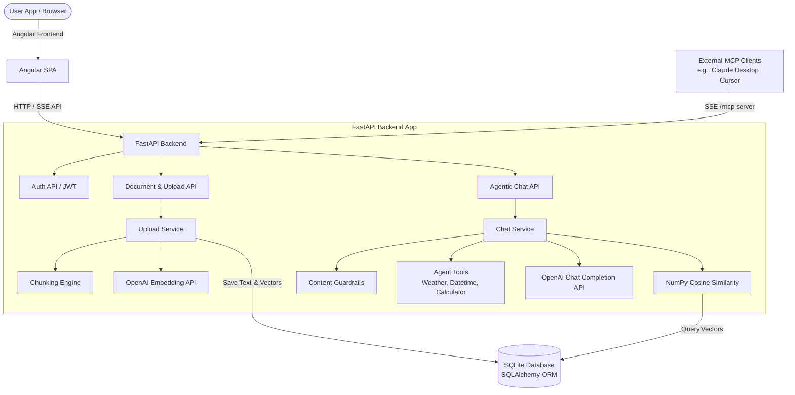

# AI Knowledge Assistant

A unified, agent-driven Retrieval-Augmented Generation (RAG) assistant designed to ingest, process, and answer queries about complex documents with built-in safety guardrails, streaming responses, and Model Context Protocol (MCP) tool integration.

---

## 🌟 Project Overview

The **AI Knowledge Assistant** is a modern web application that allows users to upload documents (PDFs, DOCXs, and plain text files), automatically chunk and embed their content, and query them using natural language. 

Beyond standard RAG, the project operates as an **agentic system**: if a query cannot be answered by the uploaded documents, the system leverages external tools (such as live weather, current datetime, and mathematical calculators) or its base model knowledge to answer, rather than failing silently.

Additionally, the assistant runs a local **Model Context Protocol (MCP) server**, allowing any external LLM-powered development tools (like Claude Desktop, Cursor, or Gemini agents) to connect to it and invoke semantic search and text summarization tools directly on your knowledge base.

---

## 🛠️ Key Features

* **Multi-Format Document Ingestion:** Supports uploading `.pdf`, `.docx`, and `.txt` files.
* **Intelligent Document Chunking & Embedding:** Splits large files into semantic chunks, generates vector embeddings using OpenAI models, and stores them locally.
* **Context-Aware Semantic Search:** Employs NumPy-accelerated cosine similarity to search and retrieve relevant document sections.
* **API Structure Optimization:** Automatically detects API query intent (e.g., asking for routes, URLs, methods) and boosts Table of Contents or endpoint chunks to prioritize structured indexes.
* **Unified Agentic Chat & Tool Integration:**
  * Uses live tools: **Geocoding & Weather API** (via Open-Meteo), **System Datetime**, and a **Safe Math Calculator**.
  * Falls back dynamically to general knowledge or tool execution when the uploaded documents do not contain the answer.
* **Robust Safety Guardrails:** Ingestion validation and output sanitization to prevent prompt injection and ensure secure data handling.
* **Streaming Responses:** Implements FastAPI Server-Sent Events (SSE) for real-time streaming of LLM answers.
* **Model Context Protocol (MCP) Server:** Exposes search and summarization tools (`search_documents`, `summarize_text`) over HTTP/SSE.
* **User Authentication:** Built-in secure user registration, JWT-based login, and user-isolated document workspaces.

---

## 🏗️ Architecture & Tech Stack

### Backend (Python/FastAPI)
* **Framework:** [FastAPI](https://fastapi.tiangolo.com/) for high-performance API endpoints and Server-Sent Events (SSE).
* **Database & ORM:** [SQLite](https://www.sqlite.org/) with [SQLAlchemy](https://www.sqlalchemy.org/) for managing users, documents, and vector embeddings.
* **Vector Computations:** [NumPy](https://numpy.org/) for local, high-speed cosine similarity searches.
* **MCP Integration:** [FastMCP](https://github.com/modelcontextprotocol/fastmcp) for building a compliant Model Context Protocol server.
* **LLM Engine:** [OpenAI API](https://openai.com/) for text embeddings and chat completions.

### Frontend (TypeScript/Angular)
* **Framework:** [Angular](https://angular.dev/) single-page application.
* **Styling:** CSS3, offering a responsive sidebar layout, real-time message streaming, document management dashboards, and smooth animations.

---

## 📈 Use Cases

When presenting this project to your mentor, you can highlight the following concrete enterprise and consumer use cases:

### 1. Enterprise Policy & Compliance Assistant
* **The Problem:** Companies have hundreds of pages of internal policies, HR manuals, and compliance guidelines. Finding specific answers is tedious and time-consuming.
* **The Solution:** The AI Knowledge Assistant acts as a localized search hub. Employees upload PDFs of manuals and query them in natural language. Because of the **guardrails**, sensitive topics are handled securely, and users only search documents owned by their account (**multi-tenancy**).

### 2. Developer Portal & Interactive API Reference
* **The Problem:** Developers often struggle to find specific API routes, endpoint formats, or parameter descriptions inside large technical specification documents.
* **The Solution:** Uploading technical API docs or software specs. The assistant's **API query booster** detects when the user is asking about endpoints (e.g. GET/POST routes) and elevates the relevant Table of Contents and structural summaries to provide a precise mapping of API endpoints, functioning as a dynamic, interactive developer reference.

### 3. MCP-Enabled Local Agentic Memory
* **The Problem:** Modern AI coding assistants (like Cursor, Claude Desktop, or Gemini agents) lack access to local enterprise knowledge bases unless files are manually copied.
* **The Solution:** The backend exposes a `/mcp-server` route. Developers can configure their IDEs or chat interfaces to connect to this server. The AI model can then dynamically trigger the `search_documents` tool to query the local database on-the-fly to answer questions or write code based on internal guidelines.

### 4. Interactive Learning & Summarization Helper
* **The Problem:** Students and researchers need to read through dense academic papers, slide decks, or textbook chapters, summarize them, and calculate simple numbers or check external facts.
* **The Solution:** Uploading course documents. Users can highlight/query complex theories, and the agent uses the **summarize_text** tool and **calculator** to check math formulas mentioned in the texts, providing a unified learning companion.
